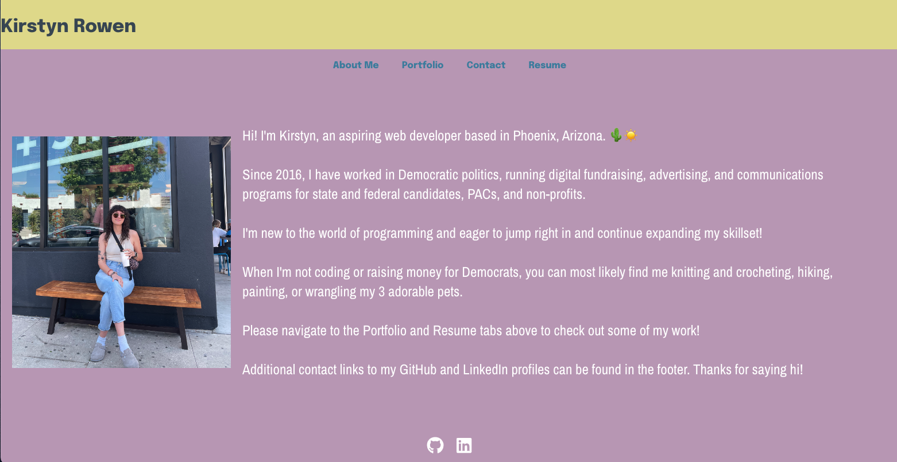

# 20 React: React Portfolio

## User Story

```md
AS AN employer looking for candidates with experience building single-page applications
I WANT to view a potential employee's deployed React portfolio of work samples
SO THAT I can assess whether they're a good candidate for an open position
```

## Table of Contents

- [Description](#description)
- [Installation](#installation)
- [Usage](#usage)
- [Mock-up](#mock-up)
- [Deployment](#deployment)
- [Questions](#questions-and-contact-information)

## Description

This application is a portfolio buils with React. It contains sections including About, Portfolio, Contact, and Resume, to showcase my work as a new developer.

## Installation

- Run `npm i` to install dependencies

## Usage

- Run `npm start` to run lauch the application.

## Mock-up

The following mockup is a screenshot of the deployed application:



## Deployment

The deployed application can be viewed [here.](https://www.loom.com/share/c9c2ec781c3444e592855c80808842c9?sid=49b209d2-2af7-4fd5-b5dd-31a71455769f)

## Questions and Contact Information

If you have any questions, please contact feel free to contact me here:

- Email: [kirstyn.rowen@gmail.com](mailto:kirstyn.rowen@gmail.com)
- GitHub: [kirstynrowen](https://github.com/kirstynrowen)
